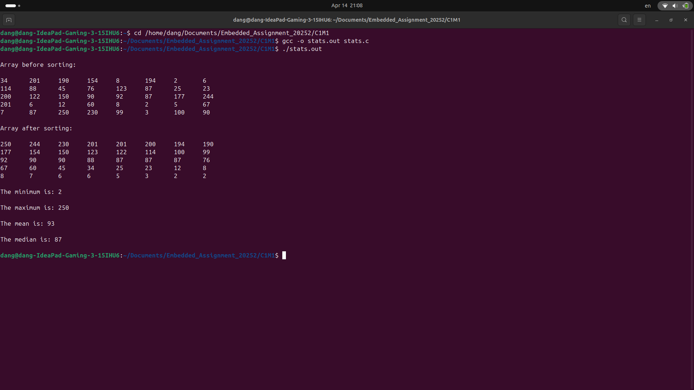

### <ins>Assignment 1 Requirements</ins>:  

- In this programming assignment we will create a simple application that performs statistical analytics on a dataset.
- Functions that can analyze an array of unsigned char data items and report analytics on the maximum, minimum, mean, and median of the data set. 
- In addition, we will need to reorder this data set from large to small. All statistics should be rounded down to the nearest integer. 
- After analysis and sorting is done, we will need to print that data.

### <ins>Output</ins>: 

Author: Renato Soriano.